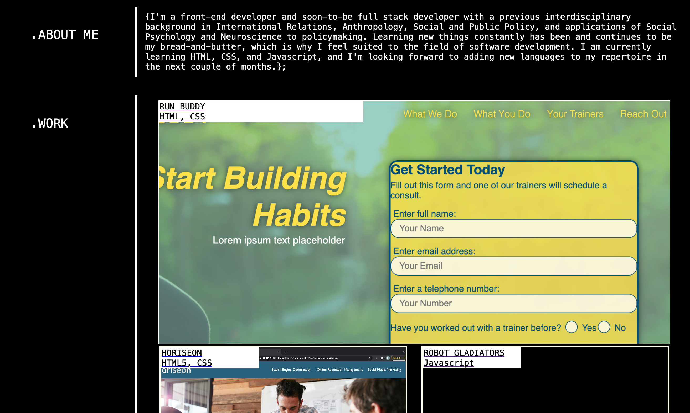
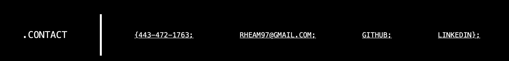

# Portfolio
my own constructed web portfolio using semantic HTML and advanced CSS

# Table of Contents
* [Project Description](#desc)
* [How I Made It](#process)
* [Usage](#usage)
* [URL](#URL)

<a name= "desc"></a>
## 02 Advanced CSS: Portfolio

A portfolio of work can showcase your skills and talents to employers looking to fill a part-time or full-time position. An effective portfolio highlights your strongest work as well as the thought processes behind it. Students who have portfolios with deployed web applications (meaning they are live on the web) are typically very successful in their career search after the boot camp. This last point can’t be stressed enough: at many companies, having several deployed projects is a minimum requirement to receive an initial interview. 

With these points in mind, in this Challenge you’ll set yourself up for future success by applying the core skills you've recently learned: flexbox, media queries, and CSS variables. You'll get to practice your new skills while creating something that you'll use during your job search. It’s a win-win that you'll likely be grateful for in the future!

<a name="process"> </a>
## How I Made It
I wanted the site to reflect my understanding of CSS syntax and properties, so I decided to base it off of some elements of a stylesheet. I went with the colors black, white, and orange because i prefer darker webpages and I wanted to add a little bit of warmth and color to some of the CSS states I wrote. I based this pilot version of my portfolio off of the mock-up to include the navigation with hover properties that is responsive to changes in screen width between computers and mobile devices (576px). I also created my own hero using free stock images of js code in what looks like VS Code and my own avatar. I then filled in the rest of the sections in the body which can be navigated to from the header. I made sure my work links had an image of the site covering the full container and also contained hover states that change the border and the opacity. I added hover states to the contact links as well. I made sure both of these elements are mobile responsive using flex properties and media queries. 


<a name= "usage"></a>
## Acceptance Criteria

```
GIVEN I need to sample a potential employee's previous work
WHEN I load their portfolio
THEN I am presented with the developer's name, a recent photo or avatar, and links to sections about them, their work, and how to contact them
WHEN I click one of the links in the navigation
THEN the UI scrolls to the corresponding section
WHEN I click on the link to the section about their work
THEN the UI scrolls to a section with titled images of the developer's applications
WHEN I am presented with the developer's first application
THEN that application's image should be larger in size than the others
WHEN I click on the images of the applications
THEN I am taken to that deployed application
WHEN I resize the page or view the site on various screens and devices
THEN I am presented with a responsive layout that adapts to my viewport
```

The following screenshots show the web application's appearance:




<a name= "URL"></a>
## URLs

* The URL of the deployed application: https://rheam97.github.io/Portfolio/

* The URL of the GitHub repository that contains your code. Give the repository a unique name and include a README file that describes the project: https://github.com/rheam97/Portfolio.git

- - -
© 2021 Trilogy Education Services, LLC, a 2U, Inc. brand. Confidential and Proprietary. All Rights Reserved.